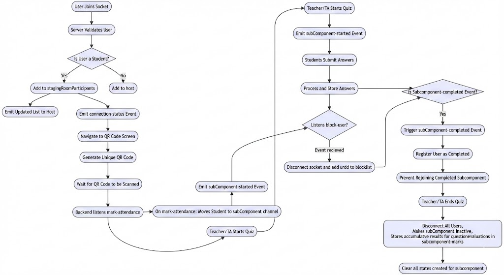

# Quiz Flow Documentation

This document explains the flow of the **Quiz** feature implemented using **Socket.IO**. It covers the sequence of events, socket communication, and the overall architecture.

---

## Table of Contents
1. [Overview](#overview)
2. [Quiz Flow](#quiz-flow)
3. [Socket Events](#socket-events)
4. [Example Diagram](#example-diagram)
5. [How to Run](#how-to-run)

---

## Overview

The **Quiz** feature uses **Socket.IO** to enable real-time communication between the server and clients. The flow involves:
- **Participants** (students) joining the quiz.
- **Hosts** (teachers or TAs) managing the quiz.
- **Real-time updates** for attendance, question emission, and answer submission.
- **Validation** for blocked users, completed subcomponents, and duplicate connections.

---

## Quiz Flow

### 1. **User Joins Socket**
- A user connects to the server using a socket.
- The server validates the user based on their role and assigns them to the appropriate room:
  - **Student**: Added to `stagingRoomParticipants`.
  - **Host (Teacher/TA)**: Added to `host-${subComponentId}`.

### 2. **Emit Updated List to Host**
- Whenever a student joins, the updated list of students is emitted to the host channel.

### 3. **Connection Status**
- When a student joins `stagingRoomParticipants`, the `connection-status` event is emitted. This event is used on the frontend to navigate the student to the QR code screen.

### 4. **QR Code Generation**
- A unique QR code is generated for each student based on their information.

### 5. **Mark Attendance**
- The student waits for the teacher or TA to scan their QR code.
- When the QR code is scanned, the frontend emits the `mark-attendance` event.
- The server validates the QR code and moves the student to the `subComponent` room where the quiz is conducted.

### 6. **Start Quiz**
- The teacher or TA starts the quiz by hitting the "Start" button on the web portal.
- This triggers the `start-subComponent` event, which emits `subComponent-started` to the `subComponent` room.

### 7. **Answer Submission**
- Students submit their answers using the `submit-answer` event.
- The server validates and stores the answers for MCQs.

### 8. **Quiz Completion**
- On the last question, both `submit-answer` and `subComponent-completed` events are triggered.
- The `subComponent-completed` event registers the student as having completed the subcomponent. This is used to prevent rejoining.

### 9. **Validation on Rejoining**
- If a student tries to rejoin the socket after completing the subcomponent, the server emits an error: "You have already completed the subComponent."

### 10. **Block User**
- If cheating is detected, the frontend emits the `block-user` event.
- The server disconnects the user and adds them to the blocked list. Blocked users cannot rejoin.

### 11. **Duplicate Connections**
- If a user tries to connect to the same subcomponent from a different device (with a different `fcm_token`), they are disconnected, and an error is emitted.

### 12. **End Quiz**
- The `end-quiz` event disconnects all users from the `subComponent` room, closes the channel, and clears all states related to the socket.

---

## Socket Events

| Event Name              | Description                              |
|-------------------------|------------------------------------------|
| `join-quiz-host`        | Host joins the quiz room.               |
| `start-subComponent`    | Starts the quiz.                        |
| `submit-answer`         | Handles answer submission.              |
| `block-user`            | Blocks a participant from the quiz.     |
| `leave-subComponent`    | Handles participant leaving the quiz.   |
| `mark-attendance`       | Marks attendance for a participant.     |
| `subComponent-completed`| Marks the quiz as completed.            |
| `end-subComponent`      | Ends the quiz.                          |

---

## Example Diagram

### Quiz Flow Diagram
```mermaid
  A[User Joins Socket] --> B[Server Validates User]
  B --> C{Is User a Student?}
  C -- Yes --> D[Add to stagingRoomParticipants]
  C -- No --> E[Add to host]
  D --> F[Emit Updated List to Host]
  D --> G[Emit connection-status Event]
  G --> H[Navigate to QR Code Screen]
  H --> I[Generate Unique QR Code]
  I --> J[Wait for QR Code to be Scanned]
  J --> K[Backend listens mark-attendance]
  K --> L[On mark-attendance: Moves Student to subComponent channel]
  L --> M[Teacher/TA Starts Quiz]
  M --> N[Emit subComponent-started Event]
  P --> Z{Listens block-user?}
  Z -- Event recieved --> Z1[Disconnect socket and add urdd to blocklist]
  N --> O[Students Submit Answers]
  O --> P[Process and Store Answers]
  P --> Q{Is Subcomponent-completed Event?}
  Q -- Yes --> R[Trigger subComponent-completed Event]
  R --> S[Register User as Completed]
  S --> T[Prevent Rejoining Completed Subcomponent]
  T --> U[Teacher/TA Ends Quiz]
  U --> V[Disconnect All Users, Makes subComponent inactive, Stores accumulatve results for questionevaluations in subcomponent-marks]
  V --> W[Clear all states created for subcomponent]


  